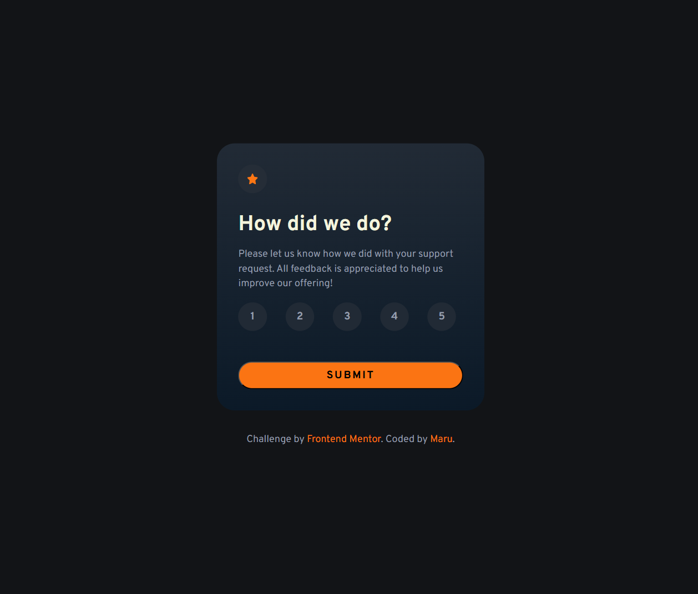
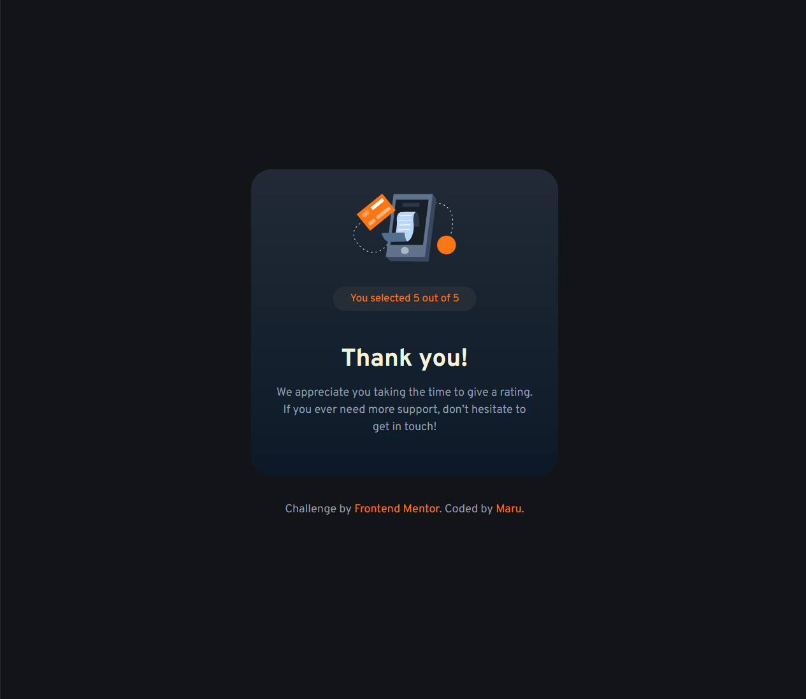

# Frontend Mentor - Interactive rating component


This is a solution to the [Interactive rating component challenge on Frontend Mentor](https://www.frontendmentor.io/challenges/interactive-rating-component-koxpeBUmI). Frontend Mentor challenges help you improve your coding skills by building realistic projects.

## Table of contents

- [Overview](#overview)
  - [The challenge](#the-challenge)
  - [Screenshot](#screenshot)
  - [Links](#links)
- [My process](#my-process)
  - [Built with](#built-with)
  - [What I learned](#what-i-learned)
  - [Continued development](#continued-development)
- [Author](#author)

## Overview

### The challenge

Users should be able to:

- View the optimal layout for the app depending on their device's screen size
- See hover states for all interactive elements on the page
- Select and submit a number rating
- See the "Thank you" card state after submitting a rating

### Screenshot





### Links

- Solution URL: [Add solution URL here](https://www.frontendmentor.io/solutions/tip-calculator-gM3JiNDaqh)
- Live Site URL: [Add live site URL here](https://tip-calculator-zeta-one.vercel.app/)

## My process

### Built with

- HTML5 markup
- CSS
- Flexbox
- CSS Grid
- JavaScript

### What I learned

- How to use `CSS Grid` with `auto-fit` and `minmax()` to create a responsive layout.
- How to apply visual feedback using `:hover` and a custom `.selected` class for interactivity.
- Improved my understanding of DOM manipulation by dynamically updating content based on user interaction.

```Css
.rating-buttons {
  display: grid;
  grid-template-columns: repeat(auto-fit, minmax(30px, 1fr));
  gap: 20px;
}
```

```JavaScript
buttons.forEach((btn) => {
  btn.addEventListener("click", () => {
    buttons.forEach((b) => b.classList.remove("selected"));
    btn.classList.add("selected");
  });
});

const toggleCards = () => {
  const selectedButton = document.querySelector(".rating-button.selected");

  if (selectedButton) {
    selectedRating.textContent = selectedButton.textContent;
    ratingSection.classList.toggle("hidden");
    successSection.classList.toggle("hidden");
    errorMessage.classList.remove("error");
  } else {
    errorMessage.classList.add("error");
  }
};
```

### Continued development

- Enhancing the UI/UX with animations or smoother error messaging.
- Toggle between light and dark themes

## Author

- Frontend Mentor - [@zerowater](https://www.frontendmentor.io/profile/zerowater4704)
- Twitter - [@jnyngxi188584](https://www.x.com/jnyngxi188584)
